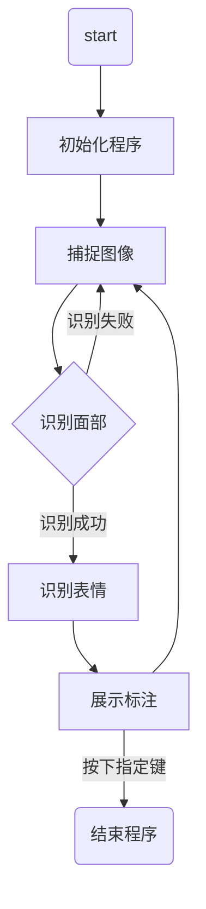
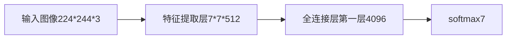

<!-- @import "[TOC]" {cmd="toc" depthFrom=1 depthTo=6 orderedList=false}   -->

<!-- code_chunk_output -->

- [1 项目介绍](#1-项目介绍)
  - [1.1 功能说明](#11-功能说明)
  - [1.2 设计意义](#12-设计意义)
- [2 研究背景](#2-研究背景)
  - [2.1 表情的研究](#21-表情的研究)
  - [2.2 表情识别的发展](#22-表情识别的发展)
- [3 技术介绍](#3-技术介绍)
  - [3.1 项目流程图(实时为例)](#31-项目流程图实时为例)
  - [3.2 项目流程说明](#32-项目流程说明)
  - [3.3 模型介绍](#33-模型介绍)
  - [3.4 模型训练](#34-模型训练)
  - [3.5 模型评估](#35-模型评估)
- [4 成果截图](#4-成果截图)
- [5 附件说明](#5-附件说明)

# 作者

- 张世奇（第一作者）
- 邵俊（第二作者）
- 汪锦星（第三作者）

# 1 项目介绍
## 1.1 功能说明
该项目实现对捕捉到人脸进行表情识别，并制作两种形式：  
1. 实时识别  
2. 截图识别（拓展）  

该项目一共设置7种表情类型：  
1. anger(生气)
2. disgust(厌恶)
3. fear(恐惧)
4. happiness(高兴)
5. neutral(中性)
6. sadness(悲伤)
7. surprise(惊喜)

## 1.2 设计意义
表情可以反应一个人的内心，既可以帮助教师理解学生的感受，也可以帮助警察在审讯时捕捉嫌疑人的心理变化
# 2 研究背景
## 2.1 表情的研究 
面部表情的研究始于19世纪，1872年，达尔文在他著名的论著《人类和动物的表情（The Expression of the Emotions in Animals andMan，1872）》中就阐述了人的面部表情和动物的面部表情之间的联系和区别。

1971年，Ekman和Friesen对现代人脸表情识别做了开创性的工作，他们研究了人类的6种基本表情（即高兴、悲伤、惊讶、恐惧、愤怒、厌恶），确定识别对象的类别，并系统地建立了有上千幅不同表情的人脸表情图像数据库，细致的描述了每一种表情所对应的面部变化，包括眉毛、眼睛、眼睑、嘴唇等等是如何变化的。
## 2.2 表情识别的发展
1978年，Suwa等人对一段人脸视频动画进行了人脸表情识别的最初尝试，提出了在图像序列中进行面部表情自动分析。

20世纪90年代开始，由K.Mase和A.Pentland使用光流来判断肌肉运动的主要方向，使用提出的光流法进行面部表情识别之后，自动面部表情识别进入了新的时期。
# 3 技术介绍
## 3.1 项目流程图(实时为例)

## 3.2 项目流程说明
1. 在初始化程序阶段，加载了模型和图像预处理方式以及opencv封装好的面部识别算法（haarcascade_frontalface_default.xml），输入的图像为已封装算法识别区域
2. 在初始化程序阶段，调用opencv的VideoCapture函数打开本机摄像头
## 3.3 模型介绍
该模型为vgg16模型的变种，主要变化在最后输出类别即softmax设置为7个类别
输入:PIL图像对象，大小为224 * 224 * 3
输出:类别序列（0-6）

## 3.4 模型训练
```python
loss_save = []
flag = 0
lr = 0.002
def train():
    batch_size = 7
    # 该处加载旧模型
    model = load_pretrained()
    optimizer = optim.SGD(params=model.parameters(), lr=lr)
    device = torch.device("cuda:0")
    model.to(device)
    loss_func = nn.CrossEntropyLoss()
    train_set = My_Dataset('archive/jaffe/train', T.ToTensor())
    train_loader = DataLoader(train_set, batch_size, shuffle=True)
    for i in range(1000):
        loss_temp = 0
        for j, (batch_data, batch_label) in enumerate(train_loader):
            batch_data, batch_label = batch_data.cuda(), batch_label.cuda()
            optimizer.zero_grad()
            prediction = model(batch_data)
            loss = loss_func(prediction, batch_label)
            loss_temp += loss.item()

            loss.backward()
            optimizer.step()
        print('[%d] loss: %.4f' % (i + 1, loss_temp / len(train_loader)))
    torch.save(model.state_dict(), 'emo12.pth')
```
由于训练次数较多，共训练12代模型，loss曲线无法制作
## 3.5 模型评估
```python
def test(model):
    model.eval()
    # 批量数目
    batch_size = 7
    # 预测正确个数
    correct = 0
    # 加载数据
    test_set = My_Dataset_test('archive/jaffe/test', transform=T.ToTensor())
    test_loader = DataLoader(test_set, batch_size, shuffle=False)
    # 开始
    for batch_data, batch_label in test_loader:
        # 放入GPU中
        batch_data, batch_label = batch_data.cuda(), batch_label.cuda()
        # batch_data, batch_label = batch_data.cpu(), batch_label.cpu()
        # 预测
        prediction = model(batch_data)
        # 将预测值中最大的索引取出，其对应了不同类别值
        predicted = torch.max(prediction.data, 1)[1]
        # 获取准确个数
        correct += (predicted == batch_label).sum()
    print('准确率: %.2f %%' % (100 * correct / 63))  # 因为总共63个测试数据
```
第一次准确率57.14%
第二次准确率65.08%
第三次准确率60.32%
结论：该模型准确率大于60%
# 4 成果截图
[](https://imgse.com/i/pCk4GpF)

# 5 附件说明
1. 模型仅保存最后一代，即emo12.pth （太大了没有上传）
3. archive文件夹为数据集文件夹
4. rubbish.py实现实时展示和识别
5. rubbish2.py实现实时展示和截图识别
6. vgg16.py包含模型和模型训练测试
